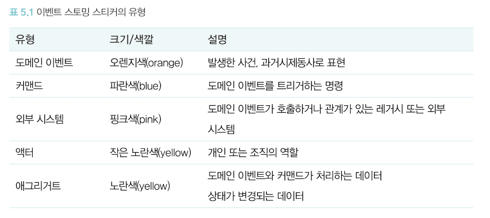

# Ch05.4~ 이벤트 스토밍을 통한 마이크로 서비스 도출

마이크로서비스 모델링의 주요 활동
1. 마이크로서비스를 도출 : 비즈니스 능력 기반, DDD의 바운디드 컨텍스트를 기반
2. 도출된 마이크로서비스를 상세하게 설계 : 쉽게 가속 화할 수 있는 워크숍 방식인 이벤트 스토밍

## 핵심 / 중요

**이벤트 스토밍의 특징 : 민첩성과 효율성
<-> 기존 방법론에서는 각 과정(요구사항, 프로세스 모델링, 설계)들이 장기간 단절되었음**
- DDD 설계를 가속화 하기위한 설계 기법 : 마이크로서비스 간의 의존성을 줄이기 위해 서비스 간 비동기 메시지 기반 도메인 이벤트를 활용하는 것이 중요, 도메인 이벤트를 통한 의존 관계를 식별하는 방법
- 모든 이해관계자가 모여 서로가 가지고 있는 각 관점을 논의하며, 그 차이점을 이해하고 공유

### 이벤트 스토밍 순서
1. 도메인 이벤트 찾기 
: 데이터나 데이터의 구조가 아닌 비즈니스 흐름에서 발생한 이벤트에 초점을 두는 것이 중요
    - 시스템의 화면을 연상하지 말고 비즈니스가 흘러감에 따라 비즈니스를 구성하는 요소들의 상태가 어떻게 변경되는지 생각한다.
2. 외부 시스템/외부 프로세스 찾기
    - 시스템 구현 범위에 있는 기능이 아니더라도 시스템의 기능 구현을 위해 연계가 필요한 시스템들은 모두 도출
3. 커맨드 찾기 : 도메인 이벤트를 동작하게 하는 것으로 명령형(동사 형태)로 작성
4. 핫스폿 찾기 : 의문 사항이 생기거나 참여하는 사람들이 결정하기 힘든 사항, 다른 부서나 외부에 문의할 필요가 있는 사항과 같이 워크숍 중에 해결하거나 정의할 수 없는 것
5. 액터(사용자/역할) 찾기
: 특정 비즈니스를 실제로 수행하는 판매자, 구매자, 상품 관리자, 배송 관리자, 시스템 관리자와 같이 명확한 역할자를 도출하려고 노력해야 한다

    - 문장을 만들어 식별한 커맨드와 이벤트를 검토
    - 문장이 자연스럽지 않다면 자연스럽게 커맨드와 도메인 이벤트를 변경하거나 새로 도출
    
    -> **이처럼 도메인 이벤트, 외부 시스템, 커맨드, 액터를 찾아봄으로써 전체 시스템의 큰 그림을 조망할 수 있다.**
6. 애그리거트 정의하기 : **애그리거트는 커맨드와 도메인 이벤트가 영향을 주는 데이터 요소**
    - DDD의 전술적 설계의 구성요소로서 가장 작은 도메인 모델의 모듈 단위
    - 애그리거트를 구체적으로 식별할수록 컨텍스트의 경계를 식별하는 데 유용

7. 바운디드 컨텍스트 정의하기 : **기능을 제공할 책임들을 응집성 있도록 동일한 애그리거트 중심으로 모듈화해야 한다**
    - 이름이 같거나 유사한 애그리거트를 완전히 다른 애그리거트와 구분해서 경계를 그린다
    - 바운디드 컨텍스트 경계는 애그리거트를 그룹화하는 크기 수준에 따라 바뀔 수 있음
    - 정책은 이벤트 뒤에 따라오는 반응적인 비즈니스 로직으로 커맨드를 동작하게 한다(정책을 도출함으로써 다른 바운디드 컨텍스트와의 관계를 식별할 수 있다)

8. 컨텍스트 매핑하기 
    - 컨텍스트 간의 관계를 작성할 때는 호출 관계의 방향/호출 방식을 고려
    - **호출 방식 (동기/비동기) : 데이터의 일관성 측면, 컨텍스트의 가용성 측면**
        - 동기 호출 : 컨텍스트 간에 항상 일관된 데이터가 필요한 관계 (실시간 동시 처리 -> 두 컨텍스트 간의 의존도 상승)
        - 비동기 호출 : 결과적 일관성으로 충분히 처리 가능한 관계
        (마이크로서비스의 독립성/가용성 증가)
    - 각 컨텍스트는 마이크로서비스가 되기 위해서는 아래의 질문을 고려
        > - (비즈니스 측면) 비즈니스 프로세스를 수행하기 위한 하나의 맥락의 단위로 구분될 수 있는가?
        > - (데이터 관점) 마이크로서비스별로 분리된 데이터를 정의할 수 있는가?
        > - (운영 조직 측면) 하나의 팀이 독립적으로 운영 가능한 단위인가?
        > - (배포 측면) 독립적으로 배포 가능한 단위인가?
        > - (변경 영향도) 변경 시 영향을 받는 마이크로서비스가 존재하는가?
        > - (클라우드/MSA 도입 목적 측면) 도입을 통한 기대효과를 충분히 활용할 수 있는가?

### 마이크로서비스 상세설계
마이크로서비스 도출, 서비스 간 연관관계 식별, 마이크로서비스별 스펙이 완성 -> 본격적인 스프린트 시작

- 프론트엔드 모델링 : 사용자 요건에 적절한 아키텍처를 정의(SPA, 반응형 UI, RIA 기반 등)
    - 아키텍처를 수립할 때 프론트엔드 프로그램의 패키지 구조도 정의 : 업무를 고려 (물리적으로 분리/모노리스 구조 유지시 패키지별로 정확한 오너십 구분 필요)
    - 과정 : 표준 레이아웃 정의, UI레이아웃 설계, UI 디자인 및 UI 레이아웃 반영, 이벤트 설계

- 백엔드 모델링
    | 이벤트 스토밍의 요소 | 헥사고날 구조 |
    | --------------- | ---------- |
    |커맨드|인바운드 어댑터(REST API)|
    |애그리거트|도메인 모델(내부 영역)|
    |도메인 이벤트|아웃바운드 메시지 처리 어댑터(외부영역)의 처리 대상|
    |외부 시스템|아웃바운드 어댑터가 호출해야 할 외부 연계 시스템|

    - 외부 영역 설계 => API 설계
    - 내부 영역 설계 => 도메인/데이터 모델링

#### API 설계 
프런트엔드와 백엔드의 연계를 위한 계약
- REST(Representational State Transfer) API : HTTP 프로토콜을 사용한 네트워크 기반 아키텍처 스타일
    - 구성 요소 : 자원, 행위, 표현
    - 입출력 데이터 : JSON 포맷

- 바람직한 API 설계 : REST API 성숙도 모델 참고
    - HTTP 메서드 사용 -> API 사용자는 리소스에 어떠한 메서드를 사용했을 때 어떠한 행위가 발생할지 인지할 수 있다.

- API 설계 문서화 : **공유와 협업 측면에서 고려**
(애자일 모델링 방식을 추구할 때 가급적이면 불필요한 설계물을 남기는 것은 바람직하지 않음)
    - 최소 다음의 요소 포함
        - 서비스명, API명, 리소스(URI)
        - 요청 매개변수, 요청 샘플
        - 응답 매개변수, 응답 샘플

#### 도메인 모델링
- **내부 구조 : "폴리그랏하다"**
    - **구현하는 언어나 데이터를 저장하는 저장소를 서비스마다 다양하게 활용**
    - **내부 아키텍처 구조를 서비스 특성에 맞게 다양하게 수립(도메인 모델 중심 / 트랜잭션 스크립트 형태)**
    - **서비스가 제공할 기능이 어떠한가 & 팀의 역량 수준도 고려 필요 (객체지향 설계 및 문화에 능숙한지 여부)**

- DDD의 전술적 설계(도메인 모델링 구성요소)
    - DDD에서는 명확한 클래스의 유형과 애그리거트 단위 식별을 통해 도메인 모델을 간결하고 단순하게 유지하는 것을 추구
    - 기존 객체 모델링 방식은 자유도가 높아 문제 영역을 파고들수록 여러 층의 복잡한 계층 구조를 만들게 될 가능성이 높음 -> 객체들의 역할에 따른 유형을 정의
        - 엔티티 : 고유한 식별자, 속성/상태는 변화
        - 값 객체 (VO) : 불변, 속성간의 비교를 통해 동일함이 결정됨
        - 표준 타입 : 표준 타입은 대상의 타입을 나타내는 서술적 객체 (유비쿼터스 용어로 정의 권장 - java의 경우 열거형)
        - 애그리거트 : 연관된 엔티티와 값 객체들의 묶음(트랜잭션의 기본 단위)
            - **애그리거트 내에 있는 엔티티 중 가장 상위의 엔티티를 애그리거트 루트로 정하고, 이 애그리거트 루트를 통해서만 애그리거트 내의 엔티티나 값 객체를 변경할 수 있다**
            - 별도의 마이크로서비스의 후보 -> 루트를 통한 참조로 분리에 용이
            - 애그리거트 간의 일관성 : 도메인 이벤트를 통한 결과적 일관성 사용
        - 도메인 서비스 : 비즈니스 로직 처리(상태 관리 x, 행위만 존재)
        - 도메인 이벤트 : 이벤트스토밍의 도메인 이벤트의 구현 객체

## 재미 및 호기심

이벤트 스토밍에서는 현실 세계의 도메인을 다양한 의미의 스티커로 표현한다.

